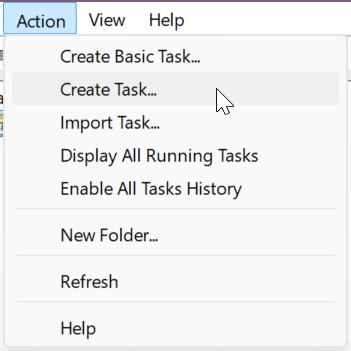
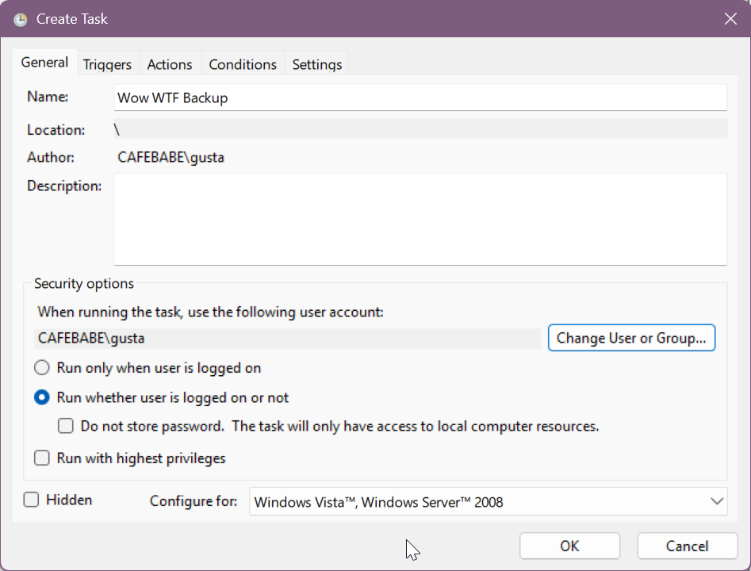
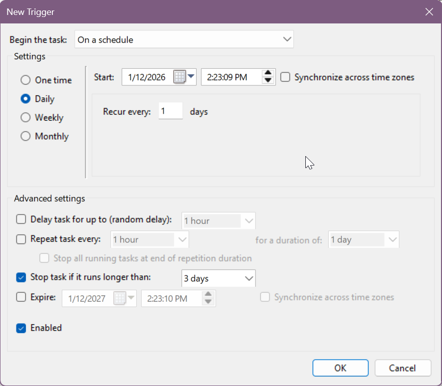
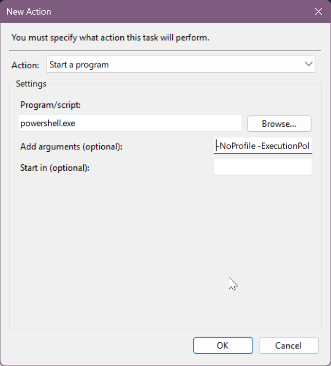

# WoW WTF Backup Script

This script creates daily ZIP backups of the WoW **WTF** directory and keeps the last 30 backups. No external dependencies.

## What It Does

- Compresses:  
  `C:\Program Files (x86)\World of Warcraft\_classic_era_\WTF`
- Saves ZIPs to:  
  `C:\Backups\WoW_WTF`
- Names backups like:  
  `WTF_YYYYMMDD_HHMMSS.zip`
- Keeps only the newest 30 archives.

## Setup

### 1. Put the script in place

Create:

```text
C:\Scripts
```

Put `wow-backup.ps1` inside it.

### 2. Allow your user to run scripts

In PowerShell:

```powershell
Set-ExecutionPolicy -Scope CurrentUser -ExecutionPolicy RemoteSigned
```

### 3. Create the backup directory manually

The script will create `WoW_WTF` inside it, but the root path must exist.

Run in PowerShell, or do it via File Explorer:

```powershell
New-Item -ItemType Directory -Path "C:\Backups" -Force
New-Item -ItemType Directory -Path "C:\Backups\WoW_WTF" -Force
```

### 4. Test the script

```powershell
powershell.exe -NoProfile -File "C:\Scripts\wow-backup.ps1"
```

A ZIP should appear in `C:\Backups\WoW_WTF`.

### 5. Schedule daily execution

Open **Task Scheduler**:

1. **Create Task…**
   - Create the actual task

   

2. **General**
   - Name: `WoW WTF Backup` (can be whatever you like)
   - Run whether user is logged on or not
   - Run with highest privileges

   

3. **Triggers**
   - Daily → choose a time

   

4. **Actions**
   - Program/script:

     ```text
     powershell.exe
     ```

   - Arguments:

     ```text
     -NoProfile -ExecutionPolicy Bypass -File "C:\Scripts\wow-backup.ps1"
     ```

   - Start in:

     ```text
     C:\Scripts
     ```

   

5. Save the task and run it once to confirm it completes cleanly.

```

```
